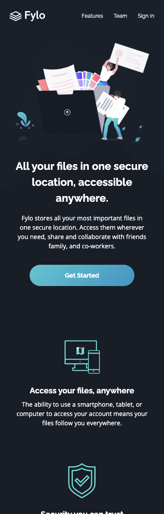
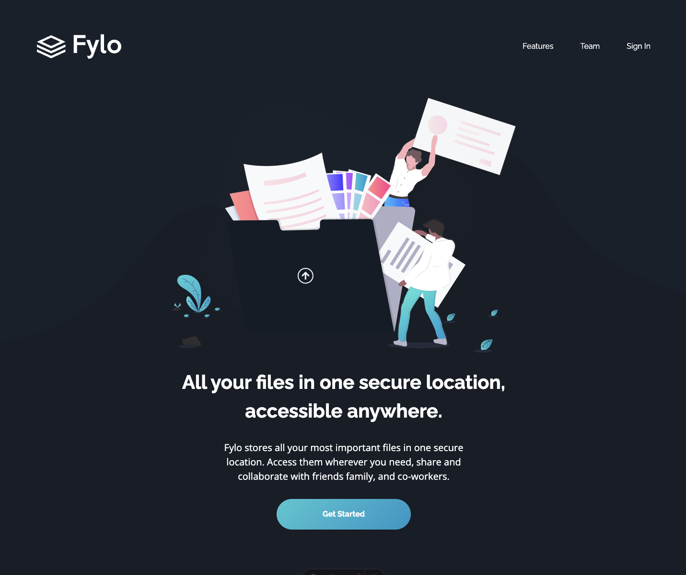

# Frontend Mentor - Fylo dark theme landing page solution

This is a solution to the [Fylo dark theme landing page challenge on Frontend Mentor](https://www.frontendmentor.io/challenges/fylo-dark-theme-landing-page-5ca5f2d21e82137ec91a50fd). Frontend Mentor challenges help you improve your coding skills by building realistic projects.

## Table of contents

- [Frontend Mentor - Fylo dark theme landing page solution](#frontend-mentor---fylo-dark-theme-landing-page-solution)
  - [Table of contents](#table-of-contents)
  - [Overview](#overview)
    - [The challenge](#the-challenge)
    - [Screenshot](#screenshot)
    - [Links](#links)
  - [My process](#my-process)
    - [Built with](#built-with)
  - [Installation](#installation)
    - [Install dependencies](#install-dependencies)
    - [Run Application](#run-application)

## Overview

### The challenge

Users should be able to:

- View the optimal layout for the site depending on their device's screen size
- See hover states for all interactive elements on the page

### Screenshot

Mobile Screenshot



Desktop Screenshot



### Links

- Solution URL: [Repository](https://github.com/evertzner/fylo)
- Live Site URL: [Planet Facts](https://fylo-esteban-vertzner.netlify.app/)

## My process

### Built with

- Astro
- TailwindCSS

## Installation

### Install dependencies

```bash
pnpm install
```

### Run Application

```bash
pnpm run dev
```
